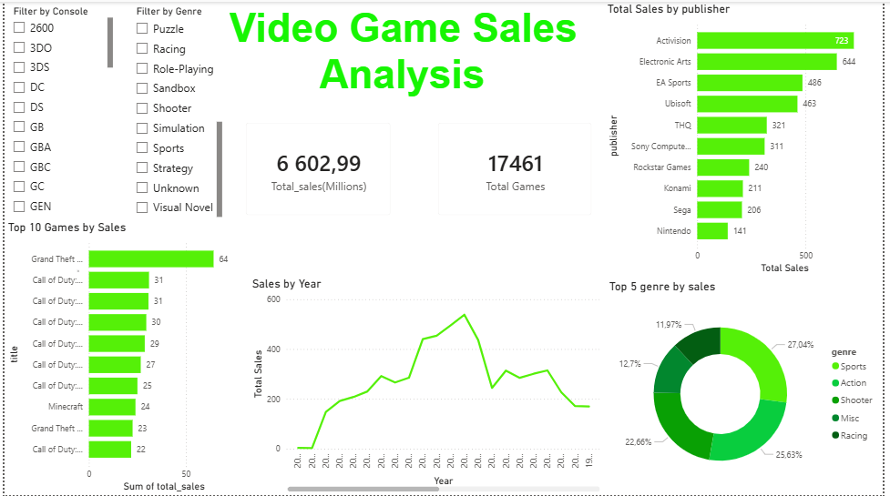

# 🎮 Video Game Sales Analysis

## Tools Used
- **MySQL** — data cleaning and querying
- **Power BI** — interactive dashboard

## Key Insights
- 🏆 **GTA V** is the best selling game at 64M units
- 📅 **2008** was the peak year with 538M in total sales
- 🎮 **Action** is the dominant genre across all consoles
- 🏢 **Activision** leads publishers with 723M in sales
- 🌍 **Call of Duty** dominates NA but barely sells in Japan
- 📉 Sales declined post-2008 due to shift to digital downloads

## Dashboard Preview

